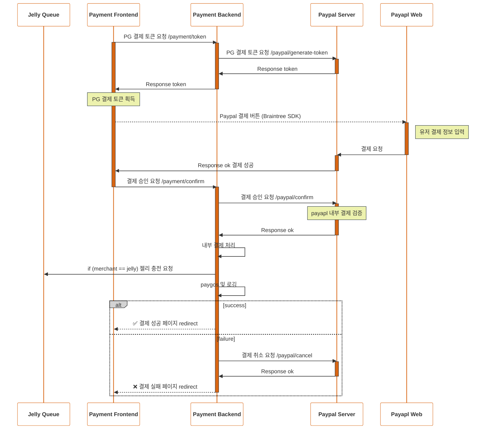
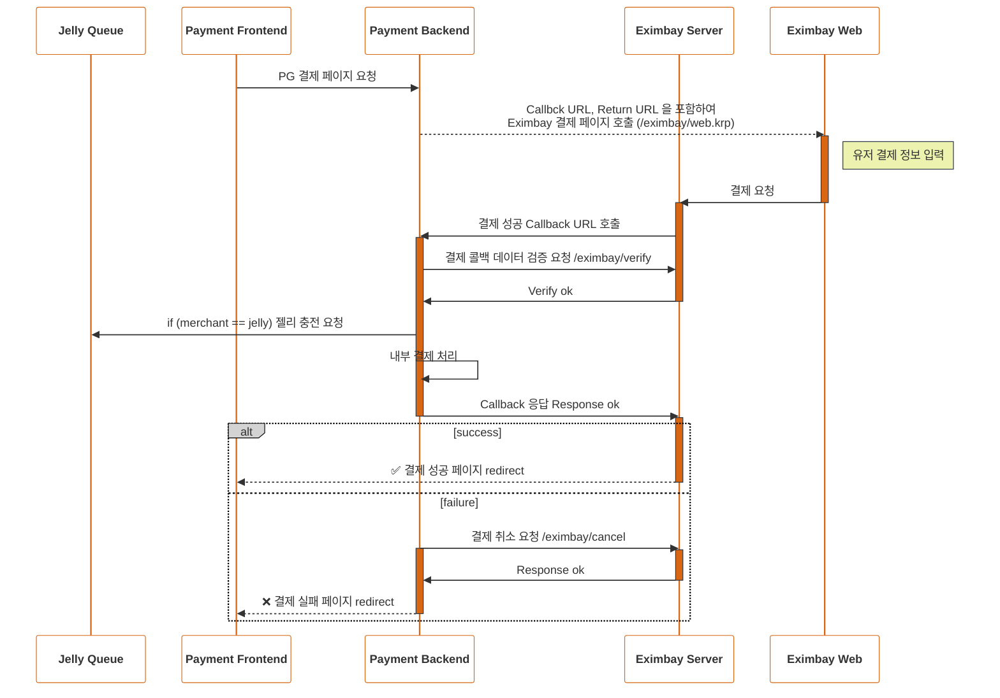

## PayPal payment flow

```mermaid
%%{init: {'sequence': { 'mirrorActors': true, 'rightAngles': true, 'messageAlign': 'center', 'actorFontSize': 20, 'actorFontWeight': 900, 'noteFontSize': 18, 'noteFontWeight': 600, 'messageFontSize': 14}}}%%
%%{init: {'theme': 'base', 'themeVariables': {'labelBoxBkgColor': 'lightgrey', 'labelBoxBorderColor': '#000000', 'actorBorder': '#D86613', 'actorBkg': '#ffffff', 'activationBorderColor': '#232F3E', 'activationBkgColor': '#D86613', 'noteBkgColor': 'rgba(255, 153, 2, .)', 'noteBorderColor': '#232F3E'}}}%%
sequenceDiagram
participant Jelly_Queue as Jelly Queue
participant Payment_Frontend as Payment Frontend
participant Payment_Backend as Payment Backend
participant Paypal_Server as Paypal Server
participant Paypal_Web as Payapl Web


Payment_Frontend->>Payment_Backend: PG 결제 토큰 요청 /payment/token
activate Payment_Frontend
activate Payment_Backend
Payment_Backend->>Paypal_Server: PG 결제 토큰 요청 /paypal/generate-token
activate Paypal_Server
Paypal_Server->>Payment_Backend: Response token
deactivate Paypal_Server
Payment_Backend->>Payment_Frontend: Response token
deactivate Payment_Backend
Note over Payment_Frontend: PG 결제 토큰 획득
Payment_Frontend-->>Paypal_Web: Paypal 결제 버튼 (Braintree SDK)


activate Paypal_Web
Note right of Paypal_Web: 유저 결제 정보 입력
Paypal_Web->>Paypal_Server: 결제 요청
deactivate Paypal_Web
activate Paypal_Server
Paypal_Server->>Payment_Frontend: Response ok 결제 성공
deactivate Paypal_Server


Payment_Frontend->>Payment_Backend: 결제 승인 요청 /payment/confirm
deactivate Payment_Frontend
activate Payment_Backend
Payment_Backend->>Paypal_Server: 결제 승인 요청 /paypal/confirm
activate Paypal_Server
Note over Paypal_Server: payapl 내부 결제 검증
Paypal_Server->>Payment_Backend: Response ok
deactivate Paypal_Server
Payment_Backend->>Payment_Backend: 내부 결제 처리
Payment_Backend->>Jelly_Queue: if (merchant == jelly) 젤리 충전 요청
Payment_Backend->>Payment_Backend: paygos 및 로깅


alt success
  Payment_Backend-->>Payment_Frontend: ✅ 결제 성공 페이지 redirect
else failure
  Payment_Backend->>Paypal_Server: 결제 취소 요청 /paypal/cancel
  activate Paypal_Server
  Paypal_Server ->> Payment_Backend: Response ok
  deactivate Paypal_Server
  Payment_Backend-->>Payment_Frontend: ❌ 결제 실패 페이지 redirect
  deactivate Payment_Backend
end
```
---
## 2. Eximbay payment flow

```mermaid
%%{init: {'sequence': { 'mirrorActors': true, 'rightAngles': true, 'messageAlign': 'center', 'actorFontSize': 20, 'actorFontWeight': 900, 'noteFontSize': 18, 'noteFontWeight': 600, 'messageFontSize': 14}}}%%
%%{init: {'theme': 'base', 'themeVariables': {'labelBoxBkgColor': 'lightgrey', 'labelBoxBorderColor': '#000000', 'actorBorder': '#D86613', 'actorBkg': '#ffffff', 'activationBorderColor': '#232F3E', 'activationBkgColor': '#D86613', 'noteBkgColor': 'rgba(255, 153, 2, .)', 'noteBorderColor': '#232F3E'}}}%%


sequenceDiagram
participant Jelly_Queue as Jelly Queue
participant Payment_Frontend as Payment Frontend
participant Payment_Backend as Payment Backend
participant Eximbay_Server as Eximbay Server
participant Eximbay_Web as Eximbay Web
  
Payment_Frontend->>Payment_Backend: PG 결제 페이지 요청
Payment_Backend-->>Eximbay_Web: Callbck URL, Return URL 을 포함하여 <br> Eximbay 결제 페이지 호출 (/eximbay/web.krp)


activate Eximbay_Web
Note right of Eximbay_Web: 유저 결제 정보 입력
Eximbay_Web->>Eximbay_Server: 결제 요청
deactivate Eximbay_Web


activate Eximbay_Server
Eximbay_Server->>Payment_Backend: 결제 성공 Callback URL 호출


activate Payment_Backend
Payment_Backend->>Eximbay_Server: 결제 콜백 데이터 검증 요청 /eximbay/verify
Eximbay_Server->>Payment_Backend: Verify ok


# Note over Payment_Backend: 결제 금액 검증


deactivate Eximbay_Server
Payment_Backend->>Jelly_Queue: if (merchant == jelly) 젤리 충전 요청
Payment_Backend->>Payment_Backend: 내부 결제 처리
Payment_Backend->>Eximbay_Server: Callback 응답 Response ok
deactivate Payment_Backend
activate Eximbay_Server


alt success
  Eximbay_Server-->>Payment_Frontend: ✅ 결제 성공 페이지 redirect
  deactivate Eximbay_Server
else failure
  Payment_Backend->>Eximbay_Server: 결제 취소 요청 /eximbay/cancel
  activate Payment_Backend
  activate Eximbay_Server
  Eximbay_Server ->> Payment_Backend: Response ok
  deactivate Eximbay_Server
  Payment_Backend-->>Payment_Frontend: ❌ 결제 실패 페이지 redirect
  deactivate Payment_Backend
end
```
